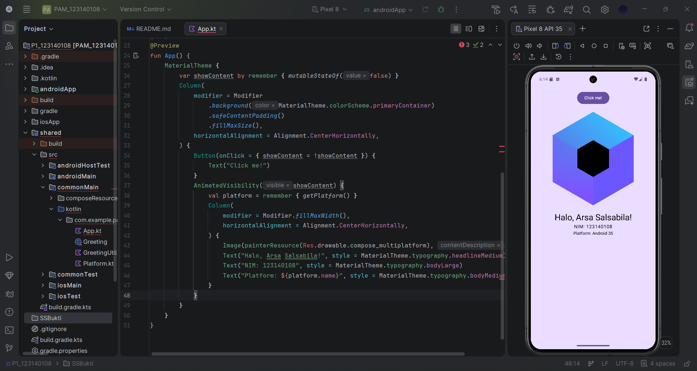

# Tugas Praktikum 1 Pengembangan Aplikasi Mobile

Tugas ini merupakan latihan awal untuk setup environment Kotlin Multiplatform (KMP) dan modifikasi dasar pada aplikasi "Hello World".

- **Nama:** Arsa Salsabila
- **NIM:** 123140108

## Screenshot Hasil

---
*Dibuat untuk memenuhi Tugas Praktikum ke-1.*
