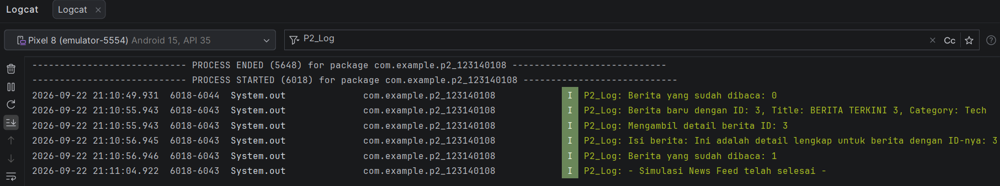

# Tugas Praktikum 2 Pengembangan Aplikasi Mobile - News Feed Simulator

Proyek ini dibuat untuk memenuhi Tugas Praktikum (P2) mata kuliah Pengembangan Aplikasi Mobile (PAM). Aplikasi ini mengimplementasikan konsep *Advanced Kotlin* seperti **Coroutines**, **Flow**, **StateFlow**, serta operator transformasi data (`filter` dan `map`) dalam arsitektur Kotlin Multiplatform (KMP).

* **Nama:** Arsa Salsabila
* **NIM:** 123140108

---

## Fitur Utama & Konsep yang Diterapkan
1. **Kotlin Coroutines & Suspend Functions:** Menjalankan proses asinkron untuk mengambil detail berita secara periodik tanpa memblokir alur kerja utama aplikasi.
2. **Kotlin Flow (`flow`, `delay`):** Membuat aliran data berita otomatis setiap beberapa detik.
3. **Operator Transformasi Flow:**
  * **`filter`**: Menyaring berita agar hanya menampilkan kategori tertentu (contoh: *"Tech"*).
  * **`map`**: Mengubah format judul berita menjadi huruf kapital (`uppercase()`).
4. **State`Flow`:** Melacak dan memantau jumlah berita yang sudah dibaca secara *real-time*.

---

## Cara Menjalankan & Melihat Hasil Simulasi

Karena simulator ini dirancang untuk memproses aliran data asinkron di latar belakang, seluruh keluaran (*output*) simulasi dicatat melalui sistem *logging* dan dapat dilihat langsung pada **Logcat** Android Studio.

1. Clone atau buka repositori ini di **Android Studio**.
2. Sambungkan perangkat fisik atau jalankan **Android Emulator**.
3. Lakukan Sync project dengan gradle files
4. Klik tombol **Run (ikon panah hijau)** di bagian atas Android Studio untuk memulai aplikasi.
5. Setelah aplikasi terbuka di emulator (menampilkan teks antarmuka utama), buka tab **Logcat** di bagian bawah Android Studio.
6. Ketik **`P2_Log`** pada kolom pencarian Logcat untuk memfilter dan memantau jalannya simulasi berita secara *real-time*.

---

## Dokumentasi Hasil (Logcat Output)

Berikut adalah hasil eksekusi simulasi *News Feed Simulator* yang dapat dilihat di Logcat:

---

## 📂 Struktur Proyek
* `androidApp/src/main/kotlin/com/example/p2_123140108/MainActivity.kt` — Berisi logika utama *News Feed Simulator*, model data, implementasi Flow/StateFlow, dan antarmuka Compose.