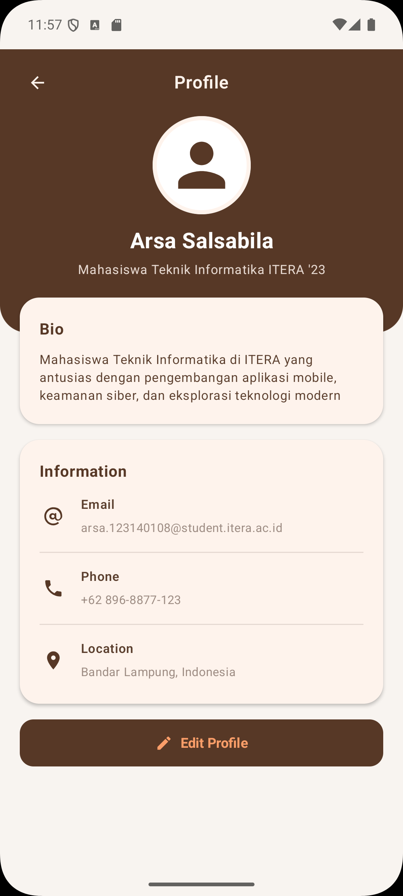

# Tugas Praktikum Minggu 3 - My Profile App

Aplikasi **My Profile App** dibuat menggunakan **Compose Multiplatform** sebagai bagian dari Tugas Praktikum Minggu 3 Pengembangan Aplikasi Mobile.
- Nama : Arsa Salsabila
- NIM  : 123140108

---

## Screenshot Aplikasi

<p align="center">
  
</p>

---

## Fitur Utama & Struktur UI

Aplikasi ini menampilkan Halaman Profil pengguna:

1. **Profile Header (Full-Width)**:
   - Header berwarna cokelat (`#573826`) yang direntangkan penuh (full-width) kanan dan kiri layar.
   - Navigation Bar dengan tombol kembali dan Judul "Profile".
   - Foto Profil berbentuk **circular** dengan outline border krem (`#FEF3EC`).
   - Nama Pengguna: **Arsa Salsabila**
   - Role / Subtitle: **Mahasiswa Teknik Informatika ITERA '23**

2. **Bio Card (Overlap / Menimpah Header)**:
   - Card informasi bio yang **menimpah/overlapping** bagian bawah dari card header name.
   - Berisi deskripsi latar belakang dan minat pengguna.

3. **List Informasi Kontak**:
   - **Email**
   - **Phone**
   - **Location**

4. **Tombol ("Edit Profile" dan "back")**:
   - Tombol **"Edit Profile"** dengan ikon edit di bagian bawah profil dan tombol untuk back dari halaman profil.

---

## Reusable Composable Functions

Terdiri dari minimal 3 Composable function modular dan reusable:
- `ProfileHeader`: Komponen header profil yang menampilkan tombol navigasi, foto profil circular, nama, dan role.
- `ProfileCard`: Komponen kontainer berbentuk `Card` dengan warna background krem (`#FEF3EC`) yang digunakan untuk seksi Bio dan Information.
- `InfoItem`: Komponen item baris (`Row`) berisi Ikon, Label, Nilai informasi, serta garis pemisah (`Divider`).

---

## Palette Warna 

- `#573826` : Primary Dark Brown (Header & Action Button)
- `#5B3F2E` : Secondary Brown (Text Title)
- `#9E8D84` : Muted Taupe (Sub-text & Divider)
- `#FEF3EC` : Light Cream (Card Background & Header Text)

---

## Layout & Component yang Digunakan

- `Column` & `Row` (Tata letak vertikal & horizontal)
- `Box` (Layering, positioning avatar, & divider)
- `Card` (Container Bio & Information)
- `Text` (Penampil teks nama, bio, dan info)
- `Button` (Tombol aksi "Edit Profile" dan "back")
- `Image` & `Icon` (Penampil foto profil circular & ikon email, phone, location, edit)

---

## Implementasi Ikon (`ProfileIcons.kt`) & Manfaatnya

Semua ikon pada aplikasi ini (`ArrowBack`, `PersonAvatar`, `Email`, `Phone`, `Location`, dan `Edit`) dibuat secara **programatik murni di dalam kode Kotlin** menggunakan `ImageVector.Builder` pada file [`ProfileIcons.kt`](./shared/src/commonMain/kotlin/com/example/p3_123140108/components/ProfileIcons.kt).

### Manfaat Menggunakan Metode Ini:
1. **Ukuran APK Lebih Kecil & Efisien**:
   - Tidak memerlukan file bitmap `.png` atau resource XML tambahan di folder `res/drawable`, sehingga menghemat memori dan memperkecil ukuran akhir APK.
2. **Tanpa Dependency Eksternal**:
   - Tidak perlu menambahkan pustaka berat seperti `material-icons-extended` ke dalam Gradle, menjaga proses *compile* tetap cepat.
3. **Resolusi Tinggi & Scalable**:
   - Berbasis grafik vektor murni yang dapat membesar/memgecil pada berbagai kerapatan layar (*density*) dari HDPI hingga XXXHDPI tanpa kehilangan ketajaman atau pecah.
4. **Portabilitas Cross-Platform (Multiplatform Ready)**:
   - Karena ditulis murni dalam Kotlin Jetpack Compose, aset ikon ini dapat langsung digunakan di Android, iOS, maupun Desktop tanpa dependensi spesifik OS.

---

## Cara Menjalankan Aplikasi

```bash
# Build Android App
./gradlew :androidApp:assembleDebug
```
