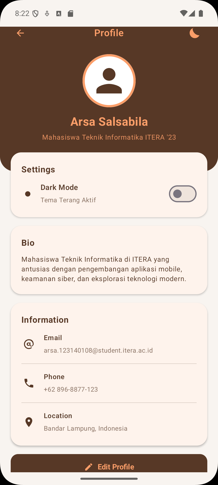
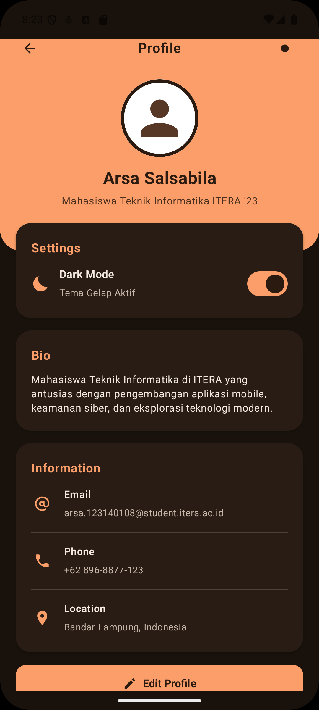
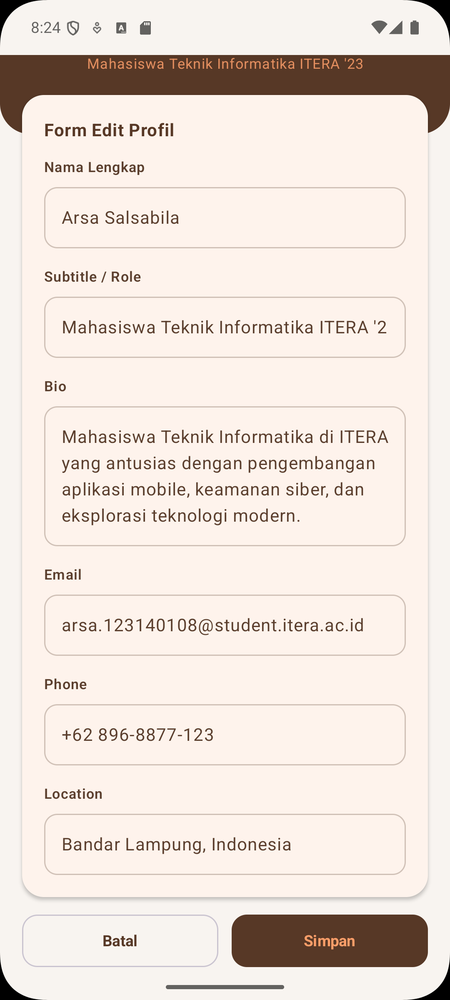
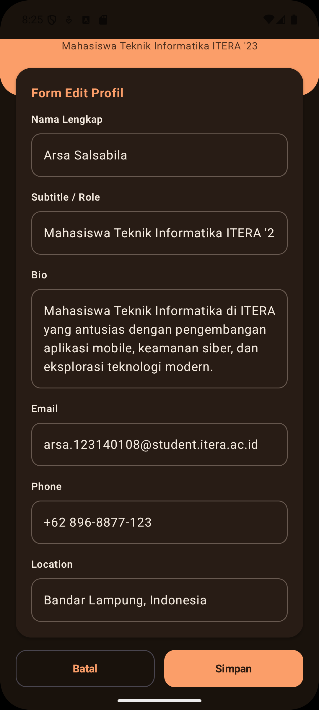

# Tugas Praktikum 4 PAM - Profile App dengan Penambahan Fitur Edit Profile dan Dark Mode

**Profile App** dikembangkan menggunakan **Kotlin Multiplatform (KMP)** & **Compose Multiplatform** sebagai bagian dari Tugas Praktikum Minggu 4 Mata Kuliah Pengembangan Aplikasi Mobile.

- **Nama** : Arsa Salsabila
- **NIM**  : 123140108

---

## Screenshot Aplikasi

| Profile View (Light Mode) | Profile View (Dark Mode) |
| :---: | :---: |
|  |  |

| Form Edit (Light Mode) | Form Edit (Dark Mode) |
| :---: | :---: |
|  |  |

---

> **Catatan Penyesuaian Warna**:  
> Terdapat sedikit perubahan dan penyesuaian skema warna dari versi minggu sebelumnya agar seluruh elemen UI (teks, kartu, ikon, dan tombol) memiliki tingkat kontras yang optimal serta dapat bertransisi dengan mulus saat mengaktifkan fitur *Dark Mode*.

---

### 1. Implementasi MVVM Pattern
- **UI State Class (`ProfileUiState.kt`)**: Imutabel data class penampung seluruh data UI (nama, subtitle, bio, email, phone, location, status dark mode, dan status mode edit).
- **ViewModel (`ProfileViewModel.kt`)**: Menggunakan `MutableStateFlow` (private mutable) dan `StateFlow` (public read-only) untuk mengelola state secara reaktif dan tahan terhadap *configuration changes* (seperti rotasi layar).

### 2. Fitur Edit Profile
- **Form Edit**: Pengguna dapat mengubah Nama Lengkap, Subtitle/Role, Bio, Email, Nomor Telepon, dan Lokasi.
- **State Hoisting**: Komponen `LabeledTextField` dibuat *stateless* (menerima state `value` dari parent dan memicu callback `onValueChange` ke ViewModel).
- **Action Buttons**: 
  - **Simpan**: Memperbarui state utama di `ProfileViewModel` dan menutup mode edit.
  - **Batal**: Membatalkan semua isian form dan kembali ke mode view tanpa mengubah data utama.

### 3. Fitur Dark Mode 
- **Switch Control**: Disediakan kontrol `Switch` pada Card Settings serta ikon toggle pada Top Bar Header.
- **Reactive Theme**: Status `isDarkMode` disimpan di `ProfileViewModel`. Saat di-toggle, `ProfileAppTheme` secara otomatis dan mulus mengubah skema warna antara `CustomLightColorScheme` dan `CustomDarkColorScheme`.

---

## Struktur Folder Project

```
shared/src/commonMain/kotlin/com/example/p3_123140108/
├── data/
│   └── ProfileUiState.kt         # Data class penampung UI State
├── viewmodel/
│   └── ProfileViewModel.kt       # Business Logic & State Management
├── ui/
│   ├── theme/
│   │   └── Theme.kt              # Custom Light & Dark Theme ColorScheme
│   ├── components/
│   │   ├── LabeledTextField.kt   # Reusable Stateless Component (State Hoisting)
│   │   ├── ProfileHeader.kt      # Banner Header & Avatar
│   │   ├── ProfileCard.kt        # Card Container
│   │   ├── InfoItem.kt           # Item Informasi Kontak
│   │   └── ProfileIcons.kt       # Vector Icons (Person, Email, Phone, Edit, Moon, Sun)
│   ├── ProfileScreen.kt          # Main Profile View & Settings Card
│   └── EditProfileScreen.kt     # Form Edit Profile
└── App.kt                        # Root Composable Function
```
---

## Cara Menjalankan Aplikasi

1. Buka project di **Android Studio**.
2. Pastikan target konfigurasi pada toolbar atas memilih **`androidApp`**.
3. Pilih Virtual Device (Emulator Android).
4. Klik tombol **Run (▶)** atau tekan `Shift + F10`.
